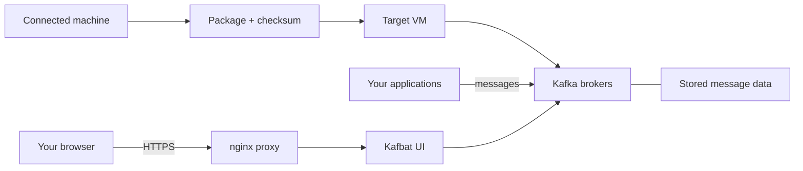

<a id="readme-top"></a>

<div align="center">
  

  <h1>Krate</h1>

  <p>Portable Kafka packages for Ubuntu and RHEL virtual machines.</p>

  <p>
    <a href="https://github.com/bso-d/Krate/actions/workflows/broker-ci.yml">
      
    </a>
    <a href="https://github.com/bso-d/Krate/actions/workflows/codeql.yml">
      
    </a>
    
    
    <a href="LICENSE"></a>
  </p>

  <p>
    <a href="#start-on-a-connected-machine">Get started</a> ·
    <a href="#build-an-offline-package">Build a package</a> ·
    <a href="https://github.com/bso-d/Krate/releases">Downloads</a> ·
    <a href="#guides">Guides</a>
  </p>
</div>

<details>
  <summary>Contents</summary>

  - [What Krate does](#what-krate-does)
  - [Problems Krate solves](#problems-krate-solves)
  - [How it differs from similar repositories](#how-it-differs-from-similar-repositories)
  - [Choose an edition](#choose-an-edition)
  - [What you need](#what-you-need)
  - [Start on a connected machine](#start-on-a-connected-machine)
  - [Build an offline package](#build-an-offline-package)
  - [Install the package on a VM](#install-the-package-on-a-vm)
  - [Everyday commands](#everyday-commands)
  - [Monitoring](#monitoring)
  - [How the parts fit together](#how-the-parts-fit-together)
  - [Limits to understand](#limits-to-understand)
  - [Development and checks](#development-and-checks)
  - [Component credits](#component-credits)
  - [Contributing and community conduct](#contributing-and-community-conduct)

</details>

## What Krate does

[Apache Kafka](https://kafka.apache.org/) lets applications send, store, and read streams of messages. A Kafka **broker** is a server that handles those messages. Several brokers working together form a **cluster**.

Krate supplies the files and command-line tools to run a Kafka cluster with [Docker](https://www.docker.com/), which runs software in containers. It can also collect the container images and setup files into one compressed package. Build that package on a machine with internet access, copy it to a matching virtual machine (VM), and install it there without downloading the images again.

Each edition includes [Kafbat UI](https://github.com/kafbat/kafka-ui), a browser interface for viewing brokers, topics (named message streams), and consumer groups (applications sharing the work of reading messages). The UI sits behind an nginx web proxy with HTTPS and a login.

## Problems Krate solves

| Problem | What Krate provides |
| --- | --- |
| The VM cannot download container images | A package containing the images and setup files, plus a checksum to check the transferred file |
| The VM has a different processor or operating system from the build machine | A build for the chosen processor, a processor check before installation, and matching Ubuntu or RHEL Docker packages when requested |
| Setup steps are spread across separate commands and files | A command script for installation, health checks, logs, and message backlog, with the UI already configured |
| Measurements and logs need separate setup | Included monitoring files and images, started with a separate command when needed |

You still need suitable disk space, OS dependencies, and working network settings. Krate prepares the software and runs host checks; the deployment guides cover the remaining host setup.

## How it differs from similar repositories

| Repository | Main purpose | Krate's focus |
| --- | --- | --- |
| [Apache Kafka Docker examples](https://github.com/apache/kafka/tree/trunk/docker/examples) | Show how to configure single-node and multi-node Kafka containers, including encrypted and authenticated connections | Provide selected cluster setups with an offline package builder, optional Docker installer, management commands, UI, and monitoring |
| [Confluent cp-all-in-one](https://github.com/confluentinc/cp-all-in-one) | Run examples of the broader Confluent Platform, including schema management, connectors, and stream-processing services | Package Kafka, its UI, and monitoring for VM installation; those extra Confluent services are not included |

Krate adds package builds and host management commands around Kafka and Docker, especially for a VM without internet access. Its supplied clusters share one host and need additional configuration for secure remote application access.

## Choose an edition

Ubuntu and Red Hat Enterprise Linux (RHEL) are the target operating systems.

| Edition | What it runs | Intended host | Command |
| --- | --- | --- | --- |
| **Krate (default)** | Four brokers; Kafka manages its own coordination | Ubuntu 22.04 or 24.04, x86_64 or ARM64 | `kraft/krate` |
| **EPC** | Two brokers using KRaft, with message data stored under `/data` | Tailored for RHEL 9, x86_64 or ARM64 | `epc/krate` |

These are the two active releases. Each package contains its own security features and monitoring files. The `zk/` directory is a frozen legacy package for existing users. EPC is the tailored RHEL deployment.

For a first local run, the steps below use KRaft. All brokers in these setups run on the same host.

### Ready-made downloads

The [releases page](https://github.com/bso-d/Krate/releases) holds two kinds of release. Check the tag prefix and title before downloading:

| Kind | Tag | Title starts with | What you get |
| --- | --- | --- | --- |
| **Offline install package** | `package-kraft-vN`, `package-epc-vN` | `Offline install package` | A `.tar.gz` to copy to the VM, its `.sha256` checksum and the image lock file. Install it with `./krate install`. From `package-kraft-v2` and `package-epc-v4` on, a `-sources.tar` beside each package holds the corresponding source of its copyleft components; earlier package releases have none. |
| **Broker images** | `kraft-vX.Y.Z`, `zk-vX.Y.Z` | `Broker images` | References to container images on GHCR. Nothing to install on a VM; the default setups do not use these images. |

Current offline install packages. Each includes Keycloak SSO, the Grafana and Perses monitoring paths, and the Docker packages for its target OS. Upgrade steps from the earlier packages are in each release's notes:

| Release | Edition | Packages |
| --- | --- | --- |
| [`package-kraft-v2`](https://github.com/bso-d/Krate/releases/tag/package-kraft-v2) | KRaft, Ubuntu 24.04 | `krate-kraft-v2-amd64.tar.gz` (x86_64), `krate-kraft-v2-arm64.tar.gz` (ARM64) |
| [`package-epc-v4`](https://github.com/bso-d/Krate/releases/tag/package-epc-v4) | EPC, RHEL 9 | `krate-epc-v4-amd64.tar.gz` (x86_64), `krate-epc-v4-arm64.tar.gz` (ARM64) |

Earlier packages:

| Release | Package |
| --- | --- |
| [`package-kraft-v1`](https://github.com/bso-d/Krate/releases/tag/package-kraft-v1) | KRaft with Keycloak SSO, Grafana monitoring only, x86_64 and ARM64: `krate-kraft-v1-<arch>.tar.gz` |
| [`package-epc-v3`](https://github.com/bso-d/Krate/releases/tag/package-epc-v3) | RHEL/EPC with Keycloak SSO, Grafana monitoring only, x86_64: `krate-epc-v3-amd64.tar.gz` |
| [`epc-v2`](https://github.com/bso-d/Krate/releases/tag/epc-v2) | RHEL/EPC with Keycloak SSO, x86_64: `krate-epc-v2-amd64.tar.gz` |
| [`epc-v1`](https://github.com/bso-d/Krate/releases/tag/epc-v1) | RHEL/EPC, x86_64: `kafka-epc-v1-amd64.tar.gz` |
| [`v1.0.0`](https://github.com/bso-d/Krate/releases/tag/v1.0.0) | Archived ZooKeeper package, x86_64: `kafka-zk-v5-amd64.tar.gz` |

New packages are released as `package-kraft-vN` and `package-epc-vN`; see [Release an offline install package](#release-an-offline-install-package). To target Ubuntu 22.04 or another combination, build a package from source using the commands below. Earlier downloads keep their original `kafka-*` names. KRaft and EPC packages use `krate-*`; ZooKeeper keeps `kafka-zk-*`.

## What you need

- **To run a cluster:** Docker Engine 25.0.3 or newer, a working Docker service, and Docker Compose. The scripts accept the `docker compose` plugin or standalone `docker-compose` 1.29.2 or newer; the examples use the plugin.
- **To create the UI certificate:** OpenSSL, or your own certificate and key at `certs/server.crt` and `certs/server.key`.
- **To run from a checkout or build packages:** a connected machine with Docker, Bash, Git, Python 3, Node.js and npm (for the Kafbat UI image), and GNU Make 4.0 or newer, which `./krate` calls for you. On macOS, `brew install make` provides it.
- **For KRaft/EPC monitoring:** Python 3 on the host, in addition to Docker.

Choose the package for the target VM's processor: `amd64` means x86_64; `arm64` means ARM64. Leave room for the package, loaded images, and stored messages. The EPC guide explains how to budget its `/data` disk.

## Start on a connected machine

1. Clone the repository.

   ```bash
   git clone https://github.com/bso-d/Krate.git
   cd Krate/kraft
   ```

2. Optionally set the UI hostname, for example `./krate config set KAFKA_UI_FQDN=kafka.example.com`. Left blank, it is this machine's hostname.

3. Start the cluster and show its logins.

   ```bash
   ./krate start
   ./krate credentials
   ```

The first `start` does all of the setup: it creates `.env` and `monitoring/.env`, generates every password and secret, creates a self-signed UI certificate, builds the Kafbat UI image (several minutes) and downloads the other images. Nothing needs copying or editing by hand. `./krate setup` runs the same preparation without starting anything. When startup is complete, `start` reports healthy services and `credentials` prints every address and login; open the Kafbat UI address to view the four brokers.

The generated certificate is self-signed, so the browser will show a trust warning. You can trust `certs/server.crt` or supply a certificate trusted by your browser.

For ZooKeeper, use `cd Krate/zk` and `./kafka` instead of `./krate`. Use `start` when running directly from the repository. The `install` command is for an extracted package containing saved images.

## Build an offline package

Run `./krate package` on the connected machine, from `kraft/` for the KRaft package or `epc/` for the EPC package:

```bash
cd Krate/kraft
./krate package v1 amd64          # for an x86_64 VM
./krate package v1 arm64          # for an ARM64 VM
./krate package v1 amd64 none     # without Docker installation packages
```

`v1` is a package label in the form `vN`. The processor defaults to the build machine's. The last argument selects the Docker installation packages bundled for VMs without Docker: by default `noble` (Ubuntu 24.04) for KRaft and `rhel9` for EPC; `jammy` selects Ubuntu 22.04 and `none` leaves them out.

`package` builds the Kafbat UI image for the target processor, downloads the Docker packages, saves every pinned image and checks the result. For the first command above it writes:

```text
dist/release/package-kraft-v1/
├── krate-kraft-v1-amd64.tar.gz
├── krate-kraft-v1-amd64.tar.gz.sha256
├── krate-kraft-v1-amd64.tar.gz.images.lock.tsv
└── krate-kraft-v1-amd64.notes.md
```

The package includes the cluster files, its command script, saved Docker images, and monitoring files. The image record lists the exact images, their checksums, and their processor type; a copy is also inside the package.

The Ubuntu installer uses `dpkg` and may try `apt-get` to repair missing dependencies. Make sure the target has the required OS dependencies before relying on a fully offline install. The RHEL installer disables network repositories; missing OS dependencies must be supplied locally. The frozen ZooKeeper package is still built with `make bundle VERSION=vN MODE=zk`.

## Install the package on a VM

Copy the package and its `.sha256` file to the VM. For the KRaft package built above:

```bash
sha256sum -c krate-kraft-v1-amd64.tar.gz.sha256
tar -xzf krate-kraft-v1-amd64.tar.gz
cd krate-kraft-v1-amd64
```

The checksum should report `OK`.

If Docker is missing and you included its packages, run `./krate docker-install` first. It needs administrator access. Then run:

```bash
./krate doctor
./krate install
```

`doctor` checks Docker, package architecture, certificates, host ports, and firewall settings. `install` runs those checks again, loads the saved images and installs the package into `/opt/krate/kraft` (`/opt/krate/epc` for EPC; set `KRATE_HOME` to choose another directory). There it does the same setup as `start` (settings, generated passwords, certificate), starts the cluster, waits for it to be healthy and prints every login. `credentials` shows them again later.

The installation directory holds everything specific to the site: `.env`, `monitoring/.env`, the certificate in `certs/` and the SSO files under `auth/`. The cluster's Docker project is always `krate-kraft` (or `krate-epc`), whatever directory a package was unpacked to, so its data volumes keep the same names.

### Update to a newer package

Unpack the new package anywhere and run its `./krate install`, with the cluster running or stopped. It replaces only the release files in the installation directory and loads the new images. Settings, passwords, certificates, SSO files and stored messages stay; new image pins and settings are added automatically.

Installations from before `/opt/krate` ran inside their package directory, and their Docker project and volumes were named after it. The first `install` of a newer package finds that installation through its containers, takes over its `.env`, `monitoring/.env`, certificate and SSO files, and keeps using its data volumes (recorded as `KRATE_PROJECT` in `.env`). If the old containers were already removed, name the old directory: `./krate install --from /path/to/krate-kraft-v1-amd64`.

For a downloaded ZooKeeper package, use `./kafka`. For EPC, set `KAFKA_ADVERTISED_HOST` for clients on other machines and review the data directory before the first start.

## Everyday commands

Run these in the installation directory (`/opt/krate/kraft` or `/opt/krate/epc`) or a checkout's `kraft/` or `epc/`. Run from an extracted package, they act on the installation:

| Command | What it does |
| --- | --- |
| `./krate credentials` | Shows every address and login: Kafbat UI, Grafana, Perses and, with SSO, Keycloak |
| `./krate status` | Lists the services and their state |
| `./krate health` | Checks whether services are healthy |
| `./krate logs -f kafka-92` | Follows one broker's logs |
| `./krate lag` | Shows how many messages consumer groups still need to read |
| `./krate lag my-group` | Shows that backlog for one group |
| `./krate stop` / `./krate start` | Stops or starts services, keeping stored messages |
| `./krate down` | Removes containers while keeping stored messages |
| `./krate identity up` | Starts the Keycloak identity service and its database, creates its admin on first start |
| `./krate identity status` / `./krate identity users list` | Shows identity service health; lists local users |
| `./krate identity renew-db-tls` / `./krate identity logrotate --install` | Renews the identity database certificate; hands the identity journal to the host's logrotate |
| `./krate auth configure [--force] [--viewer-messages]` / `./krate auth apply` | Plans Kafbat's Keycloak login (`auth/ui/runtime.yml`) from `.env`; validates and applies it to the UI |
| `./krate help` | Lists the available commands |

Use `./kafka` for the ZooKeeper edition. EPC also has `./krate disk` to show data-disk usage against the configured budget.

Settings live in `.env`. The `*_IMAGE` lines are the exception: every command that runs Docker Compose (`start`, `stop`, `status`, `health`, `logs`, `install`, `setup`, `identity ...`, `monitor up`, `auth apply`) first resets them to the pins in `.env.template`, so a rebuilt Kafbat UI image or a newer package takes effect without editing `.env`. Commands that only read or edit settings (`config`, `ui`, `credentials`, `help`) leave `.env` as it is. To use a different image, change `.env.template`. For example, `./krate config set KAFKA_UI_FQDN=kafka.example.com` updates the UI hostname setting. After changing a setting used by a container, run `./krate start` to apply it. After changing the certificate hostname, also run `./krate gen-cert` and `./krate restart proxy`.

In the supplied KRaft and ZooKeeper setups, `uninstall --purge` deletes stored Kafka messages by removing their Docker storage volumes. EPC stores messages in host folders under `KAFKA_DATA_DIR` (default `/data`), so those messages remain after purge. Deleting EPC messages requires stopping the cluster and separately removing its broker folders. Purge is not part of the normal stop/start workflow.

## Identity and SSO for EPC and regular Krate

Each edition includes Keycloak as a local identity service with a PostgreSQL
database, both in the `sso` profile of the edition's Compose file. The
operator flow is: `./krate setup` or `./krate start`, then
`./krate identity up`, then (Phase 2) `./krate auth configure` and
`./krate auth apply`.

Acceptance of the identity work is decided by the executable gate
`scripts/gate-identity.sh` (criteria, tests and receipts:
[sso/guides/identity-gate.md](sso/guides/identity-gate.md)).

The certificate `./krate gen-cert` (or the first start) writes covers the host
FQDN, the host of `KEYCLOAK_PUBLIC_URL` and `localhost`, so `./krate auth apply`
passes its hostname check on a fresh install (an IP address as the host gets
an IP entry, which browsers require for an IP host). After changing
`KEYCLOAK_PUBLIC_URL`, run `./krate gen-cert` and then `./krate start` or
`./krate auth apply`: the proxy's Compose environment carries a digest of
`nginx.conf` and the certificate (`KRATE_PROXY_CONF_SHA`) and, in Keycloak
sign-in mode, the one `Host` value it serves (`KRATE_PROXY_PUBLIC_HOST`: the
public host, plus `:port` unless 443), so those commands recreate it exactly when
one of them changed. In Keycloak sign-in mode an HTTPS request with any other
`Host` header (name or port) is closed without a response, and the plain-HTTP
port only redirects to the public origin; open the UI at the
`KEYCLOAK_PUBLIC_URL` origin (`./krate ui` prints it).

Offline Docker RPMs: `make docker-rpms` downloads the Docker CE packages plus the
base-OS dependencies a minimal host may lack (`container-selinux`, `nftables`
and the libraries nftables needs: `libnftnl`, `jansson`, `libmnl`) into
`optional/`, from the builder image `RHEL_BUILDER_IMAGE` (default: the Rocky
Linux project's maintained `rockylinux/rockylinux:9`, pinned by digest; the
Docker Official Image `rockylinux:9` is no longer updated). `krate
docker-install` (and the bundled `docker-offline/install-docker.sh`, which uses
the same selection) adds only the bundled packages that provide a capability
`dnf` names as missing on that host, over up to three rounds (an added package
can name its own missing library), and otherwise tells you which capability to
take from the OS media. The whole flow was proven offline on a Rocky Linux 9.8 VM
with SELinux enforcing (see `sso/guides/identity-gate.md`).

`./krate identity up` generates the database TLS material and the realm, starts
PostgreSQL and Keycloak, creates the permanent Keycloak admin and verifies the
`krate-cli` service account. Until it has run, `./krate start` prints
`Identity services skipped (run: krate identity up)` and starts the cluster
without Keycloak. `./krate identity users` manages local users;
`./krate identity rotate`, `backup`, `restore` and `recover-admin` cover
secrets, the database and a lost admin login; `renew-db-tls` reissues the
database certificate and `logrotate --install` rotates the journal. Keycloak,
its database, the proxy and Kafbat share a private `identity` Docker network
on which the proxy has a fixed address that Keycloak trusts for forwarded
headers (`KRATE_IDENTITY_SUBNET`, `KRATE_IDENTITY_PROXY_IP` in `.env`). The
[identity foundation guide](sso/guides/identity-foundation.md) holds the
inventory of projects, ports, volumes and credentials, the trust boundaries,
every procedure and the upgrade steps for a Keycloak database from before
`krate identity`.

With `KAFKA_UI_AUTH_CONFIG=runtime.yml` Kafbat signs users in through Keycloak
only (`./krate auth configure` plans it from `.env`; no shared form login; the
realm groups decide Viewer and Admin access). With a site file,
`./krate auth configure site.json` also writes the PingFederate plan
`auth/keycloak/pingfederate-idp.json`, which `./krate auth apply` applies to
the realm: every login then goes to PingFederate, brokered users are created
without linking to local accounts, and local users sign in only by appending
`&kc_idp_hint=` (empty) to the realm's authorization URL after pressing Kafbat's
"Log in with Keycloak" button (the break-glass procedure in the operator
guide). SSO requires Compose 2.20.2 or newer.
`./krate auth apply` validates the installation and reconciles only the UI
service, using locally loaded images. It does not start Keycloak: when
Keycloak is not ready it stops and tells you to run `./krate identity up`.
Keycloak and PostgreSQL are included in both offline packages even when the
SSO profile is inactive. See the
[IAM configuration guide](sso/guides/pingfederate-iam-guide.md) and the
[operator setup guide](sso/guides/dual-login.md).

From a checkout, `./krate start` builds the customized Kafbat image when it is
missing and `./krate build` rebuilds it; see the [build notes](kafbat-ui/README.md).
Offline packages include that image. EPC packages include SSO from
`epc-v2`, and KRaft packages from `package-kraft-v1`.

## Monitoring

Krate and EPC each include monitoring files in their package. Prometheus collects measurements and evaluates alert rules, and a host exporter supplies disk, CPU, and memory measurements. Fluent Bit collects container logs. Two dashboard and alerting paths run side by side: Grafana with Loki and Grafana email, and Perses (HTTPS) with VictoriaLogs and Alertmanager email. See the [monitoring guide](monitoring/README.md).

Its settings and passwords are prepared with the cluster's; `./krate credentials` shows the logins. Perses uses the cluster certificate in `certs/`. From inside an extracted package, `monitoring/` is beside `krate`; in the repository, it is at the root. With the cluster already running:

```bash
./krate monitor up
./krate monitor status
./krate monitor ui
```

The default Grafana address uses port `3000`; Perses uses HTTPS on `3443`. Prometheus (`9090`) and Loki (`3100`) have no login and are bound to `127.0.0.1` on the host (`PROM_BIND`, `LOKI_BIND` in `monitoring/.env`; set `0.0.0.0` to publish them). Email alerts require your own mail server and recipients; they are off by default. When enabled, Grafana and Alertmanager both send them. Perses supports company SSO with native IdP-group roles; see the [Perses SSO guide](sso/guides/perses-sso.md).

ZooKeeper has its own smaller stack: Kafka measurements, Prometheus, and Grafana, started with `./kafka monitor up`. It does not include Loki or host measurements.

## How the parts fit together

A connected machine prepares the package. The target VM runs the containers from that package:



KRaft's four containers each handle messages and participate in cluster coordination. ZooKeeper handles coordination in a separate container. EPC uses two combined broker/coordination containers. KRaft and ZooKeeper store data in Docker volumes; EPC uses host directories under `/data` by default.

### Repository layout

```text
kraft/       Four-broker KRaft setup and krate command script
zk/          Frozen ZooKeeper setup and kafka command script
epc/         Two-broker RHEL setup and krate command script
monitoring/  Shared KRaft/EPC dashboards, alerts, and log collection
docker/      Broker image definitions: release and debug versions
sso/         SSO activation helpers and operator guides
kafbat-ui/   Customized Kafbat UI build for shared login and SSO
Makefile     Package builds and source checks
```

Separate KRaft and ZooKeeper image release workflows build regular and diagnostic images for both processors. The default setup still uses the upstream Kafka images selected in each edition's `.env.template`; the release workflow requires an edition-specific tag before publishing to GHCR, GitHub's container registry.

### Release an offline install package

The [package release workflow](.github/workflows/package-release.yml) runs `scripts/package-release.sh`. That script builds the Kafbat UI image, prepares the Docker packages, builds the package and writes the release files to `dist/release/package-<edition>-vN/`. Run the same script locally first, and start the workflow only after the local package installs:

```bash
# macOS: MAKE=gmake; Node 22 recommended
scripts/package-release.sh kraft v3 amd64        # Docker packages: noble for kraft, rhel9 for epc
scripts/package-release.sh epc v5 amd64 none     # without Docker packages
```

Then start **Release offline install packages** from `main` in GitHub Actions with the same edition, version, processor and Docker package choice. The workflow creates the `package-<edition>-vN` tag and refuses a version that already exists. For EPC, it also refuses a version already released under the earlier `epc-vN` tags. A KRaft package with the highest version becomes the repository's Latest release; EPC and broker image releases do not. Broker image releases use the separate [broker release workflow](.github/workflows/broker-release.yml) and `kraft-v*`/`zk-v*` tags.

## Limits to understand

- **One host is one point of failure.** Multiple brokers on the same VM do not protect against losing that VM. EPC also needs both of its coordination nodes available; losing either prevents its two-node group from reaching agreement.
- **Remote application connections need configuration.** KRaft and ZooKeeper advertise `localhost` on ports `19092–19095` by default. Change their Compose listener settings for clients on other machines. EPC uses `KAFKA_ADVERTISED_HOST` and host ports `9092/9093`.
- **HTTPS protects the UI only.** The Kafka listeners use plaintext, without client authentication. The monitoring web endpoints use HTTP. Restrict access or add the protection your deployment needs.
- **Disk use grows with messages and topics.** EPC limits how much data each part of a topic can keep and requires topics to be created explicitly by default.
- **Host checks still matter.** A valid package and healthy containers do not verify your network, remote clients, storage capacity, or email delivery. Follow the relevant runbook on the target VM.

## Development and checks

From the repository root:

```bash
make help
make check
```

`make check` checks Bash syntax, runs ShellCheck, validates the Compose files, the offline defaults and the identity templates and realm plan. It needs GNU Make, Bash, ShellCheck, Python 3, and the Docker Compose plugin. On macOS, run `gmake check`. `make test` and `make validate` are aliases for these same checks; they do not start a cluster.

The [broker CI workflow](.github/workflows/broker-ci.yml) separately builds the broker images and checks message delivery on GitHub Actions. Use the installation and operations guides for checks on your target host.

Keep contributions focused, work on a separate branch, and describe the checks run in the pull request. Keep local test scripts and validation output out of commits.

## Component credits

Krate uses the projects below. Credit belongs to their owners, maintainers, and contributors; each project has its own license and notices.

| Component | Credit | Used for |
| --- | --- | --- |
| [Apache Kafka](https://kafka.apache.org/) and [ZooKeeper](https://zookeeper.apache.org/) | Apache Software Foundation and project contributors | Message handling and legacy cluster coordination |
| [Confluent container images](https://github.com/confluentinc/cp-docker-images) | Confluent and contributors | Kafka and ZooKeeper images in the legacy edition |
| [Docker Engine](https://www.docker.com/), [Compose](https://github.com/docker/compose), and [Buildx](https://github.com/docker/buildx) | Docker and project contributors | Running containers and building broker images |
| [containerd](https://containerd.io/) | containerd maintainers and contributors; a CNCF project | Container runtime included with the Docker packages |
| [Kafbat UI](https://github.com/kafbat/kafka-ui) | Kafbat and contributors | Browser interface for Kafka. KRaft and EPC ship a modified v1.5.0 build that adds the SSO button; the image contains the upstream license, notice, and patches. See the [build notes](kafbat-ui/README.md). |
| [Eclipse Temurin](https://adoptium.net/) | Eclipse Adoptium Working Group and OpenJDK contributors | Java runtime of the KRaft and EPC Kafbat UI image |
| [Keycloak](https://github.com/keycloak/keycloak) | Keycloak project and contributors; a CNCF project | SSO connection between Kafbat and the company identity provider |
| [PostgreSQL](https://www.postgresql.org/) | PostgreSQL Global Development Group | Keycloak data storage |
| [nginx](https://github.com/nginx/nginx) | NGINX authors, F5, and contributors | HTTPS access to the UI |
| [Kafka Exporter](https://github.com/danielqsj/kafka_exporter) | danielqsj and contributors | Kafka measurements |
| [Prometheus](https://prometheus.io/) and [Node Exporter](https://github.com/prometheus/node_exporter) | Prometheus maintainers and contributors; a CNCF project | Kafka and host measurements |
| [Grafana](https://github.com/grafana/grafana), [Loki and Promtail](https://github.com/grafana/loki) | Grafana Labs and contributors | Dashboards and alerts; Promtail remains in the frozen ZooKeeper edition |
| [Perses](https://github.com/perses/perses) and its [plugins](https://github.com/perses/plugins) | The Perses Authors | Parallel dashboards |
| [VictoriaLogs](https://github.com/VictoriaMetrics/VictoriaLogs) | VictoriaMetrics and contributors | Parallel log storage |
| [Alertmanager](https://github.com/prometheus/alertmanager) | Prometheus maintainers and contributors | Parallel alert email |
| [OAuth2 Proxy](https://github.com/oauth2-proxy/oauth2-proxy) | OAuth2 Proxy maintainers and contributors | SSO session for Perses |
| [Fluent Bit](https://github.com/fluent/fluent-bit), [dkjson](https://dkolf.de/dkjson-lua/) and [Python](https://www.python.org/) | Fluent Bit contributors, David Heiko Kolf, and the Python Software Foundation/contributors | Shared KRaft/EPC container log collection and metadata discovery; see [monitoring transition and notices](monitoring/README.md) |
| [Ubuntu](https://ubuntu.com/) | Canonical and the Ubuntu community | Ubuntu targets and Docker package preparation |
| [Red Hat Enterprise Linux](https://www.redhat.com/en/technologies/linux-platforms/enterprise-linux) | Red Hat and contributors | RHEL target for the EPC edition |
| [Rocky Linux](https://rockylinux.org/) | Rocky Enterprise Software Foundation and community | Default container used to prepare RHEL packages |
| [Alpine Linux](https://www.alpinelinux.org/) | Alpine Linux contributors | Base system used by some upstream containers |
| [Bash](https://www.gnu.org/software/bash/) and [GNU Make](https://www.gnu.org/software/make/) | GNU project, Free Software Foundation, and contributors | Command scripts and package builds |
| [Git](https://git-scm.com/) | Git maintainers and contributors | Source checkout |
| [ShellCheck](https://github.com/koalaman/shellcheck) | koalaman and contributors | Shell script checks |
| [Python](https://www.python.org/psf/) | Python Software Foundation and contributors | Monitoring alert setup |
| [OpenSSL](https://openssl-library.org/) | OpenSSL project and contributors | UI certificate creation |
| [GitHub Actions and GHCR](https://github.com/features/actions) | GitHub | Automated checks and container publishing |

The diagnostic broker images also use [BIND](https://www.isc.org/bind/) (ISC), [curl](https://curl.se/) (curl project), [iproute2](https://wiki.linuxfoundation.org/networking/iproute2) (Linux networking contributors), [jq](https://jqlang.org/) (jqlang contributors), [OpenBSD netcat](https://www.openbsd.org/) (OpenBSD project) or [Ncat](https://nmap.org/ncat/) (Nmap project), [procps-ng](https://gitlab.com/procps-ng/procps) (procps-ng contributors), and [strace](https://strace.io/) (strace contributors).

## License

Krate is licensed under the [GNU Affero General Public License v3.0](LICENSE) (`AGPL-3.0-only`). If you modify Krate and let others use it over a network, you must offer them the source of your modified version.

The third-party software Krate runs and packages, listed under [Component credits](#component-credits), keeps its own license. Offline packages include `LICENSE`, `LICENSE-SOURCES.md` and the license and notice files for those components; see `monitoring/fluent-bit/vendor/` and `monitoring/perses/vendor/notices/`.

From `package-kraft-v2` and `package-epc-v4` on, each KRaft and EPC package release also carries the complete corresponding source of the copyleft components in its container images, as a `-sources.tar` asset; see [LICENSE-SOURCES.md](LICENSE-SOURCES.md).

**Exception: the frozen ZooKeeper edition.** Its upstream Confluent and Kafbat images contain six copyleft components whose source is not publicly available (two Azul Zulu JDKs, three old RHEL 8 packages and `confluent-docker-utils`). Krate does not rebuild those images, so a ZooKeeper package ships without the source of those six components. They are listed in [LICENSE-SOURCES.md](LICENSE-SOURCES.md#unresolved-components) and in every ZooKeeper source archive.

## Contributing and community conduct

See the [contributing guidelines](CONTRIBUTING.md) for setup, validation, and pull request expectations.

Participation in Krate is governed by the [Code of Conduct](CODE_OF_CONDUCT.md). Please read it before contributing or joining project discussions.

<p align="right"><a href="#readme-top">Back to top</a></p>
