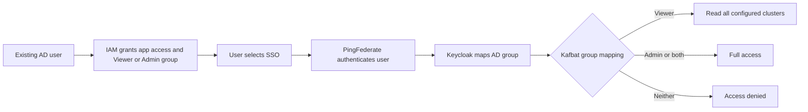

# Sign-in and enrollment

These flows apply to EPC and regular Krate.

```mermaid
sequenceDiagram
    actor User
    participant UI as Kafbat
    participant KC as Keycloak
    participant PF as PingFederate
    participant AD as Active Directory
    alt Shared Admin login
        User->>UI: Enter shared username and password
        UI->>UI: Check app credential and grant Admin
    else SSO login
        User->>UI: Click Sign in with SSO
        UI-->>User: Redirect to Keycloak
        User->>KC: Start OIDC sign-in
        KC-->>User: Redirect to PingFederate
        User->>PF: Use enterprise session or sign in
        PF->>AD: Apply identity and group policy
        PF-->>KC: Return identity and group claims
        KC-->>UI: Return signed OIDC identity and groups
        UI->>UI: Map Viewer or Admin; deny unmapped users
    end
    UI-->>User: Start app session
```



There is no per-user enrollment in Kafbat. A group change takes effect at a
new sign-in. For urgent revocation, end active application sessions as well.
